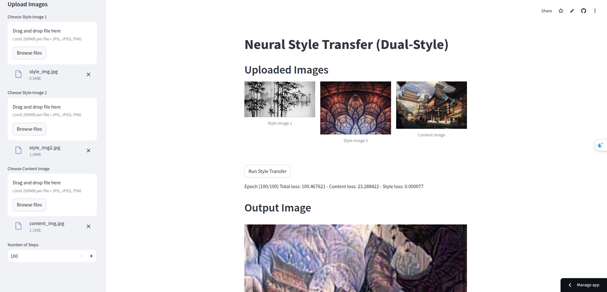

## Demo
**Link live:** https://aidemo-cdmykb4hh9u4bmgnbh9sg9.streamlit.app/

**Input Style Image1**: Upload style image1 on the left sidebar

**Input Style Image2**: Upload style image2 on the left sidebar

**Input Content Image**: Upload content image on the left sidebar

**Input Number of Steps**: Set the number of steps to implement style transfer

**Result**: After click run style transfer, we have the result

NOTE: A pre-trained model will be downloaded on the first run, which may take a while.

