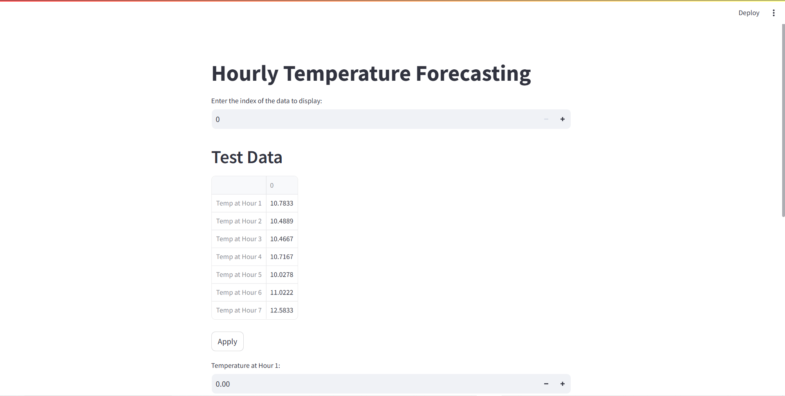
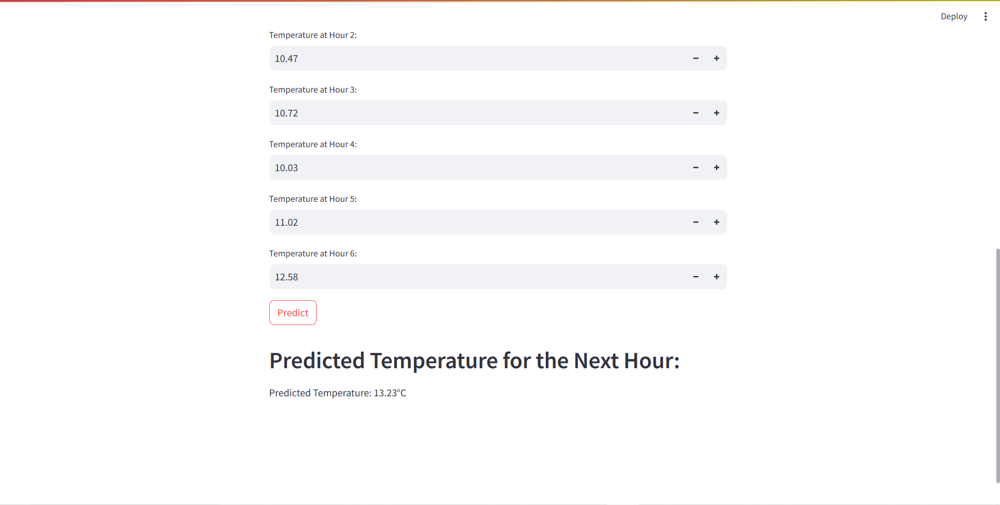

# Resource Files
`test_data.csv`: After preprocessing dataset for training, we store the test set for real data testing:
```python
X_test_flat = X_test.reshape(9639, 6)
test = pd.DataFrame(X_test_flat, columns=[f'Temp at Hour {i+1}' for i in range(6)])
test['Temp at Hour 7'] = y_test
# Output the DataFrame to a CSV file
test.to_csv('test_data.csv', index=False)
```

`model.pth`: save the model after training phase:
```python
torch.save(model.state_dict(), 'model.pth')
```

## Demo
**Input**: Can use the existing test data or input by hand

**Result**: After click predict, we have the result predict the temperature of 7th hour 


