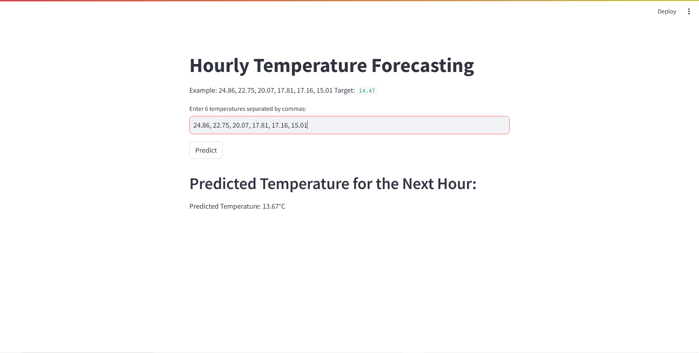

# Resource Files
`model.pth`: save the model after training phase:
```python
torch.save(model.state_dict(), 'model.pth')
```

## Demo
**Link live:** https://deploy-temp-forecasting-appvizm8b6y2iagqpkffvgx.streamlit.app/
**Input**: Can use the existing test data or input by hand
**Result**: After click predict, we have the result predict the temperature of 7th hour.



