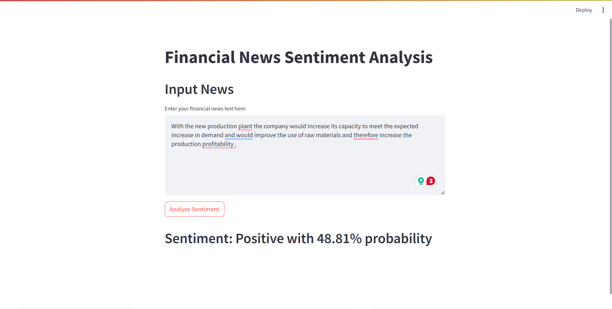

# Resource Files
`vocab.pkl`: After preprocessing dataset for training, we store the vocab for preprocessing the input from user:
```python
import pickle
with open('vocab.pkl', 'wb') as f:
     pickle.dump(vocab, f)
```

`model.pth`: save the model after training phase:
```python
torch.save(model.state_dict(), 'model.pth')
```
## Demo
**Link Live**: https://deploy-financial-sentiment-analysis-dg2gend2qln4gnyc2c2xpm.streamlit.app/  
**Pre-Infor**: We will use the vocab already processed from training dataset  
**Input**: We can input any finacial news to see it's negative, positive or neutral  
**Result**: After click predict, we we will see the label and detail probabilities of each class  
**Notice**: You need to ajust the input max-length, if the news too short and the max-length too long, we will have a lot of padding token, whick make the predict allways *negative*.  

